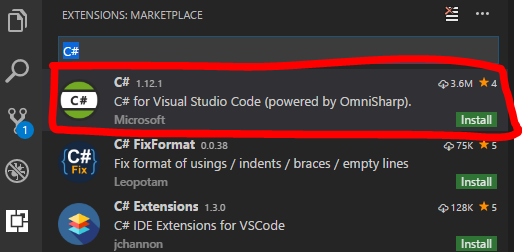

# dotNETCoreTest
.NET Coreの開発環境作成してみるテスト

## 検証環境
Windows10 Home

## やったこと
### ツール類のインストール
1. .NET Core SDKのインストール  
今回は「[.NET Core SDK 2.0.2 with .NET Core 2.0.0](https://github.com/dotnet/core/blob/master/release-notes/download-archives/2.0.2-sdk-download.md)」をインストール
 1. Visual Studio Codeのインストール  
[microsoftからダウンロード](https://www.microsoft.com/ja-jp/dev/products/code-vs.aspx)
 1. Visual Studio Codeを起動し、Visual Studio Codeの拡張機能(C#)をインストール  

 1. 拡張機能「XMLドキュメントコメント」をインストール  
 [C# XML Documentation Comments](https://marketplace.visualstudio.com/items?itemName=k--kato.docomment)

### Visual Studio Codeの設定
1. Visual Studio Codeを起動する
1. 左メニューからExplorerを選択しOpenFolderをクリック
1. カレントフォルダを選択

### コンソールアプリサンプルの作成
1. ターミナル(コマンドプロンプト)を起動する
1. 下記のコマンドを実行する  
※カレントフォルダにConsoleAppフォルダが作成される  
  ```dotnet new console -o ConsoleApp```  

### コンソールアプリの実行ファイル作成
1. プロジェクトファイル(*.csproj)に  
  ```<RuntimeIdentifiers>win-x86</RuntimeIdentifiers>```  
  を追加する
1. ターミナル(コマンドプロンプト)で  
   ```dotnet restore```  
   を実行する
1. ターミナル(コマンドプロンプト)で  
   ```dotnet publish -c release -r win-x86```  
   を実行する

### コンソールアプリのテスト作成
1. ターミナル(コマンドプロンプト)で  
   ```dotnet new xunit -o ConsoleApp.Test```  
   を実行し、テストプロジェクトを作成する
1. ターミナル(コマンドプロンプト)で  
   ```cd ConsoleApp.Test```  
   ```dotnet add reference ../ConsoleApp/ConsoleApp.csproj```  
   を実行し、テスト対象のプロジェクトを設定する
1. .vscode/tasks.jsonにtestタスクを追加する  
   [参照：.vscode/tasks.jsonのtestタスク](https://github.com/kazenetu/dotNETCoreTest/blob/master/.vscode/tasks.json#L16-L23)
1. ConsoleApp.Testディレクトリ以下にテストを書く  
   [参照：HellowTest.cs](https://github.com/kazenetu/dotNETCoreTest/blob/master/ConsoleApp.Test/HellowTest.cs)
1. testタスクを実行する   
   1. メニューから「タスクの実行」をクリック
   1. 「test」をクリック

### nugetの使い方
例）Microsoft.Data.SQLiteのインストール
1. [nuget.org](https://www.nuget.org/)で「Microsoft.Data SQLite」を検索  
   [Microsoft.Data SQLite](https://www.nuget.org/packages/Microsoft.Data.SQLite/)を選択
1. 「.NET CLI」のタブを表示し、「dotnet add package Microsoft.Data.SQLite --version 2.0.0」をコピー
1. ターミナルで「dotnet add package Microsoft.Data.SQLite --version 2.0.0」を実行
1. VisualStudioCodeでrestoreするか聞いてくるのでRestoreをクリック

### ログ設定(コンソールアプリで実行する場合)
1. ターミナルで`dotnet add package Microsoft.Extensions.Logging --version 2.0.0`を実行  
   ※インストール対象[Microsoft.Extensions.Logging](https://www.nuget.org/packages/Microsoft.Extensions.Logging/)
1. ターミナルで`dotnet add package Microsoft.Extensions.Logging.Console --version 2.0.0`を実行  
   ※インストール対象[Microsoft.Extensions.Logging.Console](https://www.nuget.org/packages/Microsoft.Extensions.Logging.Console/)
1. コンソールアプリで利用する場合は下記のように実装する
```
using Microsoft.Extensions.Logging;

namespace ConsoleApp
{
  class Program
  {
    static void Main(string[] args)
    {
      using(var loggerFactory = new LoggerFactory().AddConsole()){
        var logger = loggerFactory.CreateLogger<Program>();
        logger.LogWarning(new EventId(999),"test!");
        logger.LogError(new EventId(999),"test! {0}",new Exception("例外エラーテスト"));
      }
    }
  }
}

// 出力結果
//warn: ConsoleApp.Program[999]
//      test!
//fail: ConsoleApp.Program[999]
//      test! System.Exception: 例外エラーテスト

```

### ソリューションとWebAPIプロジェクトを作成、設定する
1. ソリューションフォルダを作成する  
   ターミナル(コマンドプロンプト)で  
   `dotnet new sln -o WebApp` 
   を実行する
1. ソリューションフォルダに移動する  
   `cd .\WebApp\`  
   を実行する
1. WebAPIプロジェクトを作成する  
   `dotnet new webapi -o WebApiSample`  
   を実行する
1. WebAPIプロジェクトをソリューションフォルダを追加する  
   `dotnet sln WebApp.sln add WebApiSample/WebApiSample.csproj`
   を実行する


### とりえず使ってみた感想
* 「定義に移動」はVisualStudioと同じようにF12。  
   わかりやすい。
* リネームがF2  
  Ctrl+Rじゃないのか……
* csファイル追加だけでちゃんとビルド対象になる  
  すごい。
* 「///」+改行でメソッドコメントが自動生成できない  
  地味に困った。カスタマイズがあるのかな。  
  [2017/10/31 追記]ちょうどいいプラグインがあった。  
  [C# XML Documentation Comments](https://marketplace.visualstudio.com/items?itemName=k--kato.docomment)
* DebugConsoleで日本語が文字化けする。  
  (実行時にShiftJISで出力されてる？)  
  プログラムに```Console.OutputEncoding =System.Text.Encoding.UTF8;```を追加すると正しく表示される。  
  これでよいのかな？
* DB接続はEF経由じゃないとダメ？  
  [nuget.org](https://www.nuget.org/)には.NetCore用のDBのServer providerが少ないのだけれど……  
  [Getting Started with EF Core on .NET Core Console App with a New database](https://docs.microsoft.com/en-us/ef/core/get-started/netcore/new-db-sqlite)  
[2017/11/04 追記]ADO.NETで接続できるものがあった。  
  [Microsoft.Data SQLite](https://www.nuget.org/packages/Microsoft.Data.SQLite/)  
  [Microsoft.Data SQLite APIリファレンス](https://docs.microsoft.com/ja-jp/dotnet/api/microsoft.data.sqlite?view=msdata-sqlite-2.0.0)
* デバッグコンソールからモジュールロードを非表示に設定するには  
   launch.jsonのconfigurations以下のnameに下記を追加する  
`"logging":{
    "moduleLoad": false
}`
* ソリューション作っておけばよかった……


## TODO
- [X] ネイティブな実行ファイル(exe)作成方法  
[Qiita:[.NET Core].NET Coreで実行ファイルを作成する](https://qiita.com/yaegaki/items/bdf529f07552d72bc6e5)
- [X] DB接続
- [X] ログ出力
- [ ] Web API 作成  
[Linux、macOS、Windows で ASP.NET Core MVC と Visual Studio Code を利用して Web API を作成する](https://docs.microsoft.com/ja-jp/aspnet/core/tutorials/web-api-vsc)

## 参考サイト
* nugetでのパッケージ取得
  * [Create .NET apps faster with NuGet](https://www.nuget.org/)
  * [Getting Started with EF Core on .NET Core Console App with a New database](https://docs.microsoft.com/en-us/ef/core/get-started/netcore/new-db-sqlite)
  * DB関連
    * [Microsoft.Data SQLite](https://www.nuget.org/packages/Microsoft.Data.SQLite/)  
    * [Npgsql](https://www.nuget.org/packages/Npgsql/)
  * ログ関連
    * [ASP.NET Core でのログ記録の概要](https://docs.microsoft.com/ja-jp/aspnet/core/fundamentals/logging?tabs=aspnetcore2x)
    * [Entity Framework Core - SQLをログで確認する(いちろぐ)](http://ichiroku11.hatenablog.jp/entry/2017/10/02/221329)
    * [Essential .NET - .NET Core によるログ記録](https://msdn.microsoft.com/ja-jp/magazine/mt694089.aspx)
* リソースファイル追加
  * [project.json プロパティと csproj プロパティの間のマッピング](https://docs.microsoft.com/ja-jp/dotnet/core/tools/project-json-to-csproj)
* 特定OS用ネイティブアプリの作成
  * [Qiita:[.NET Core].NET Coreで実行ファイルを作成する](https://qiita.com/yaegaki/items/bdf529f07552d72bc6e5)
* 文字化け対応
  * [Qiita:Visual Studio Codeタスクのdotnetコマンド出力を文字化けしないようにする](https://qiita.com/masaru_b_cl/items/705b75d256b11cb82feb)
* ユニットテスト
  * [Qiita:xUnit.net でユニットテストを始める](https://qiita.com/takutoy/items/84fa6498f0726418825d)